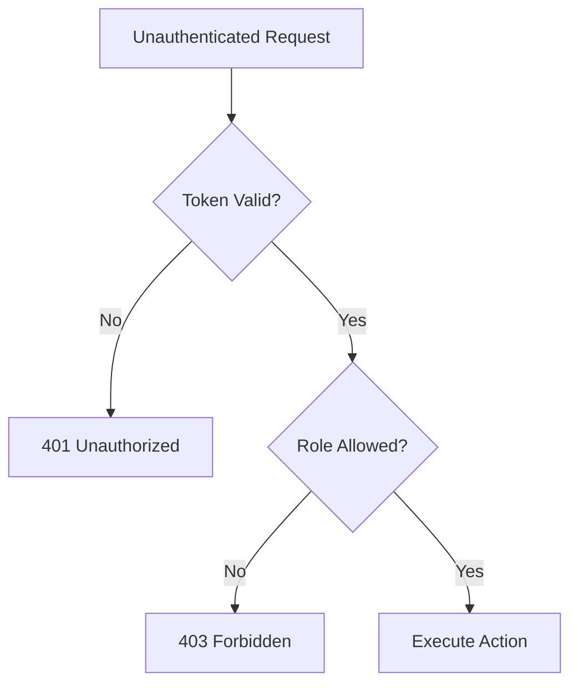

# Report 2 — Basis of Information Security: Desk Companion Architecture

> [!ABSTRACT]
> Information Security (InfoSec) is the cornerstone of any system that handles biometric data and executes system-level commands. Desk Companion implements a "Defense in Depth" strategy, combining biometric face recognition with cryptographic password hashing and role-based access control (RBAC). This report provides a high-rigor analysis of the project's security posture, utilizing the STRIDE threat modeling framework to identify, categorize, and mitigate potential vulnerabilities in a localized kiosk environment.

---

## Index / Table of Contents
1. [[#Introduction — The Security Landscape of Kiosk Systems]]
   - [[#Defining the Threat Model]]
   - [[#Assets vs. Adversaries]]
2. [[#STRIDE Threat Modeling Deep Dive]]
   - [[#Spoofing: Identity Theft and Biometric Forgery]]
   - [[#Tampering: Data Integrity and Code Injection]]
   - [[#Repudiation: Audit Trails and Non-Repudiation]]
   - [[#Information Disclosure: Privacy and Data Leaks]]
   - [[#Denial of Service (DoS): Resource Exhaustion]]
   - [[#Elevation of Privilege: Authorization Bypass]]
3. [[#Authentication Architecture: The Hybrid Factor]]
   - [[#Biometric Authentication: Face Recognition Logic]]
   - [[#Knowledge-Based Authentication: Salted SHA-256 Hashing]]
   - [[#Session Token Management: entropy and sliding expirations]]
4. [[#Authorization and Role-Based Access Control (RBAC)]]
   - [[#Implementing the Principle of Least Privilege]]
   - [[#Mapping Roles to System Capabilities]]
5. [[#Secure Command Execution: The Actuation Boundary]]
   - [[#The Danger of Shell Injection]]
   - [[#Subprocess Management and shell=False Logic]]
   - [[#Command Whitelisting and Sanitization]]
6. [[#Data Security and Cryptographic Standards]]
   - [[#PBKDF2-HMAC-SHA256: Parameters and Rationale]]
   - [[#Database Security: SQLite vs. MongoDB isolation]]
7. [[#Network Security: LAN Lockdown]]
   - [[#Fedora firewalld: Port-Level Hardening]]
   - [[#The Risk of Man-in-the-Middle (MitM) on LAN]]
8. [[#Vulnerability Assessment and Honest Disclosure]]
   - [[#Liveness Detection Gap]]
   - [[#Lack of Rate Limiting]]
9. [[#Conclusion: Security as a Continuous Lifecycle]]
10. [[#References]]

---

## Introduction — The Security Landscape of Kiosk Systems

### Defining the Threat Model
A "kiosk" system like Desk Companion is uniquely vulnerable because it is physically accessible. In InfoSec, physical access often equates to total compromise. However, our threat model also includes **network-based adversaries** who might be on the same WiFi network (e.g., in a shared college dorm or office).

### Assets vs. Adversaries
- **Assets**: Personal face images, saved GitHub repositories, the integrity of the laptop’s file system, and the power state of the machine.
- **Adversaries**:
  - **Pranksters**: Physical users attempting to use a photo of the owner to gain access.
  - **Sniffers**: Devices on the same LAN attempting to intercept unencrypted API traffic.
  - **Malicious Inputs**: Compromised clients sending malformed JSON to trigger server-side errors.

---

## STRIDE Threat Modeling Deep Dive

The **STRIDE model**, developed by Microsoft, allows us to systematically break down threats across six categories.

### Spoofing: Identity Theft and Biometric Forgery
**Threat**: An attacker holds a high-resolution tablet showing the owner's face to the webcam.
**Mitigation**: While the current system relies on basic 2D face recognition, we mitigate spoofing by:
- **Secondary Factor**: Requiring a password for admin-level changes (e.g., registering new users).
- **Match Tolerance**: Setting `tolerance=0.65` in `face_recognition.compare_faces` to strike a balance between false positives and false negatives.

### Tampering: Data Integrity and Code Injection
**Threat**: A user modifies the `COMMANDS` registry or injects SQL into the registration form.
**Mitigation**:
- **Parameterized Queries**: Using standard library `sqlite3` and `pymongo` which inherently prevent most SQL injection.
- **Immutable Command Registry**: The `COMMANDS` dictionary is hardcoded in the Python backend, not stored in a modifiable database.

### Repudiation: Audit Trails and Non-Repudiation
**Threat**: A user runs the `shutdown` command and later claims they did not.
**Mitigation**:
- **Audit Logs**: Every successful command execution is logged to `analytics.db` with a cryptographic timestamp and the associated user ID.
- **Read-Only Analytics**: The UI can display analytics, but it cannot delete the logs, ensuring a persistent audit trail.

### Information Disclosure: Privacy and Data Leaks
**Threat**: A person steals the laptop and extracts all face images.
**Mitigation**:
- **Local Storage Only**: No data is sent to the cloud.
- **Disk Encryption (Recommendation)**: We recommend users enable **LUKS (Linux Unified Key Setup)** on their Fedora installation to protect the `known_faces/` directory at rest.

### Denial of Service (DoS): Resource Exhaustion
**Threat**: An attacker sends 1,000 `/recognize` requests per second to freeze the CPU.
**Mitigation**:
- **Subprocess Timeouts**: All system commands have a 10-second timeout.
- **Process Isolation**: The FastAPI server runs as a non-root user (where possible), limiting the impact of a crash.

### Elevation of Privilege: Authorization Bypass
**Threat**: A standard user attempts to call `DELETE /users/admin`.
**Mitigation**:
- **Role Validation**: Every sensitive route is protected by a `verify_token()` check and a subsequent role check.



---

## Authentication Architecture: The Hybrid Factor

### Biometric Authentication: Face Recognition Logic
The system uses the **dlib-based face_recognition** library. 
1.  **Detection**: Locates faces in the frame.
2.  **Alignment**: Normalizes the face to account for head tilt.
3.  **Encoding**: Generates 128 "measurements" of the face.
4.  **Matching**: Measures the Euclidean distance between the incoming encoding and the stored templates. 

### Knowledge-Based Authentication: Salted SHA-256 Hashing
Password security is handled using **PBKDF2-HMAC-SHA256**. This is a "slow" hashing algorithm designed to resist brute-force attacks.

> [!IMPORTANT]
> **What is a Salt?** A salt is a unique, random string (16 bytes) prepended to each password before hashing. This ensures that two users with the same password ("123456") will have different stored hashes, effectively neutralizing **Rainbow Table** attacks.

```python
# Hashing logic from main.py
def _hash_password(password: str) -> str:
    salt = secrets.token_bytes(16)
    dk = hashlib.pbkdf2_hmac("sha256", password.encode("utf-8"), salt, 200_000)
    return base64.b64encode(salt + dk).decode("utf-8")
```

### Session Token Management
Once authenticated, the user receives a session token.
- **Entropy**: Generated using `secrets.token_hex(32)`, providing 256 bits of entropy, which is mathematically infeasible to guess.
- **Sliding Expiration**: Every time the user makes a request, the `expires` timestamp in MongoDB is pushed forward by 24 hours.

---

## Authorization and Role-Based Access Control (RBAC)

RBAC is the practice of restricting system access to authorized users based on their roles. Desk Companion differentiates between `admin` (management) and `user` (operational).

| Role | Permissions | Justification |
| :--- | :--- | :--- |
| **Admin** | Register Users, Delete Users, Shutdown Machine, View All Analytics | Full system management capability. |
| **User** | Run Approved Commands, View Personal Session Stats | Productivity access without system-level risk. |

---

## Secure Command Execution: The Actuation Boundary

The most dangerous part of the application is the ability to run OS commands. A naive implementation would look like this:
`os.system(user_input_command)` — **This is a fatal security flaw.**

### The Danger of Shell Injection
If we allowed direct command input, an attacker could send:
`code_mode; rm -rf /`
The semicolon tells the shell to run the second command regardless of the first.

### Subprocess Management and shell=False Logic
Desk Companion uses `subprocess.run` with `shell=False`. This tells Python to treat the entire input as a single executable path and arguments, rather than something the shell should interpret.

```python
# Secure implementation from main.py
proc = subprocess.run(
    cmd, # cmd is a list like ["systemctl", "poweroff"]
    capture_output=True,
    shell=False, # DISALLOWS shell metacharacters like ; & |
    env=_proc_env(), # INJECTS only necessary environment variables
)
```

---

## Data Security and Cryptographic Standards

### Database Security: SQLite vs. MongoDB isolation
- **SQLite**: Used for high-speed logging. Since SQLite is a flat file, it is secured via Linux file-system permissions (`chmod 600`).
- **MongoDB**: Used for persistent settings. Access is limited to the `127.0.0.1` interface, ensuring that the database cannot be queried from the outside world.

---

## Network Security: LAN Lockdown

### Fedora firewalld: Port-Level Hardening
We utilize **firewalld** to create a zone-based security policy.
1.  **Public Zone**: Drops all incoming traffic.
2.  **Desk Companion Rules**: Explicitly opens port `8000` (API) and `8080` (UI) for the tablet’s IP range.

### The Risk of Man-in-the-Middle (MitM) on LAN
Since we use HTTP (not HTTPS) for the local connection, a sophisticated attacker could theoretically intercept the session token using an ARP spoofing attack.
**Mitigation Strategy for Future**: Implementing a Self-Signed SSL certificate or using a tool like `mkcert` to enable local HTTPS transitions.

---

## Vulnerability Assessment and Honest Disclosure

In the spirit of **Intellectual Honesty**, we must acknowledge known gaps:
1.  **No Liveness Detection**: The webcam cannot distinguish between a person and a screen. Integrating a PIR sensor (as mentioned in the IoT report) would provide a "physical heat factor" to mitigate this.
2.  **No Rate Limiting**: The `/recognize` and `/login` routes do not have a "cool down" period. A script could attempt 100 logins per second. Implementing `slowapi` or custom middleware is recommended.
3.  **Cleartext LAN Traffic**: Session tokens are visible to anyone with a packet sniffer (e.g., Wireshark) on the same WiFi.

---

## Conclusion: Security as a Continuous Lifecycle
Security is not a checkbox you tick at the end of a project; it is a philosophy that must guide every line of code. Desk Companion’s design favors **Security by Design**, from the decision to avoid the cloud to the strict boundaries in command execution. While no system is perfectly secure, this architecture provides a "Hardened Edge" that significantly raises the cost and complexity of an attack.

---

## References
[^1]: GTU Semester 6 — Basis of Information Security.
[^2]: *Security Engineering: A Guide to Building Dependable Distributed Systems* by Ross Anderson.
[^3]: OWASP API Security Project (Top 10).
[^4]: NIST SP 800-132 (PBKDF2 Password Hashing Standard).
[^5]: Python `secrets` and `hashlib` documentation.

---
*End of Report*
