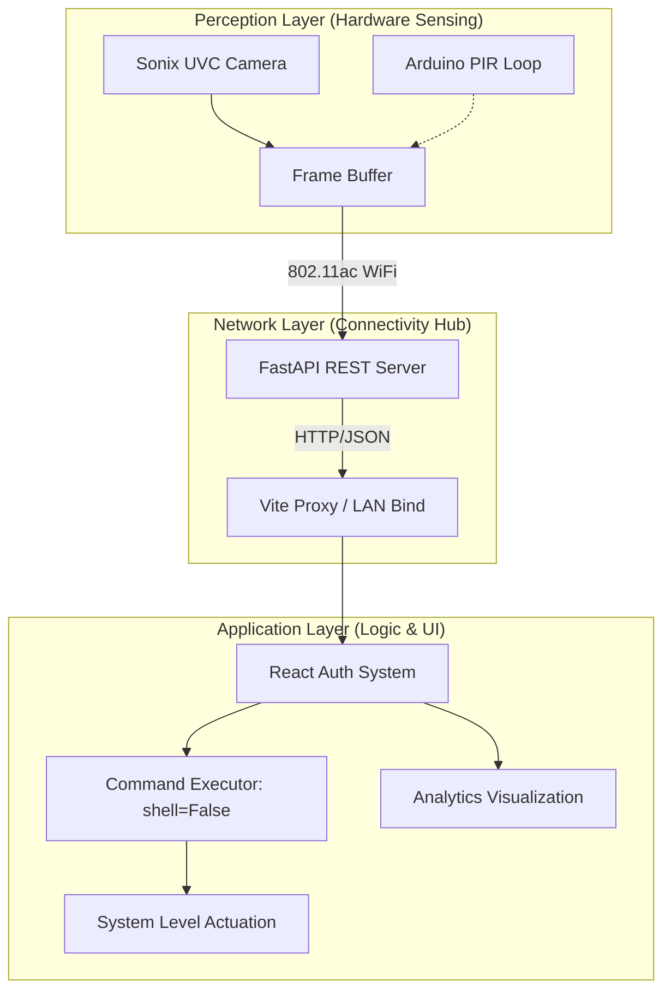
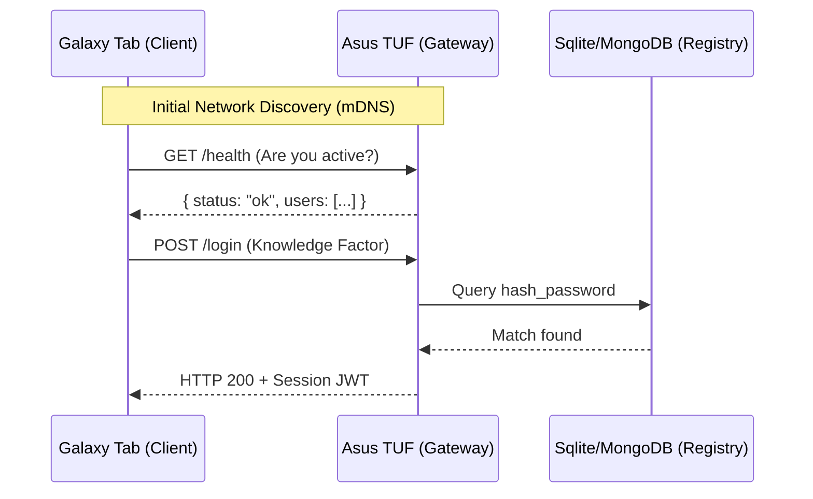

WQ# Report 1 — Fundamentals of IoT: Desk Companion Analysis

> [!ABSTRACT]
> Desk Companion is a sophisticated local-first IoT ecosystem that bridges the gap between traditional desktop computing and automated ambient intelligence. By leveraging a high-performance edge gateway (ASUS TUF Laptop) and a distributed interface node (Samsung Galaxy Tablet), the project implements a complete IoT Three-Layer Architecture. This report provides a deep technical analysis of the project's IoT significance, emphasizing the advantages of edge-first computer vision, robust local networking, and the future scalability of the ecosystem through secondary sensor integration (Arduino/ESP32).

---

## Index / Table of Contents
1. [[#Introduction to IoT & Project Context]]
   - [[#Defining the IoT Paradigm in a Local Context]]
   - [[#Desk Companion as an IoT Deployment]]
2. [[#IoT Three-Layer Architecture Deep Dive]]
   - [[#Perception Layer: Sensors and Data Acquisition]]
   - [[#Network Layer: Connectivity and Data Transport]]
   - [[#Application Layer: Logic and Actuation]]
3. [[#Edge Computing Analysis and Advantages]]
   - [[#The Shift from Cloud to Edge AI]]
   - [[#Latency Jitter and Deterministic Response Tiles]]
   - [[#Privacy Constraints in IoT Biometrics]]
4. [[#Communication Protocols and Standards]]
   - [[#HTTP/REST vs. MQTT: Architectural Decisions]]
   - [[#mDNS and Local Hostname Resolution]]
5. [[#IoT Device Profiles and Hardware Synergy]]
6. [[#Data Telemetry and Event Analytics]]
7. [[#Security in the IoT Ecosystem]]
   - [[#LAN Isolation and Perimeter Defense]]
   - [[#Biometric Spoofing and Mitigation]]
8. [[#Scalability: Towards a Multi-Sensor Smart Environment]]
   - [[#Integrating PIR Sensors via Arduino Serial]]
   - [[#Digital Twin Development Concept]]
9. [[#Conclusion]]
10. [[#References]]

---

## Introduction to IoT & Project Context

### Defining the IoT Paradigm in a Local Context
The Internet of Things (IoT) is fundamentally defined by the convergence of physical sensing, networked communication, and automated decision-making. Traditionally, IoT was synonymous with cloud-assisted devices; however, the modern paradigm has shifted towards **local-first** or **edge-native** deployments. In these systems, the network (the "Internet" in IoT) refers to the internal topology of a private LAN rather than a public WAN.

### Desk Companion as an IoT Deployment
Desk Companion transcends the definition of a standard software tool by integrating environmental sensing (webcam) with system-level actuation (desktop control). It functions as a **kiosk-based sensor gateway**. The project qualifies as a robust IoT deployment through its use of:
1.  **Heterogeneous Hardware Nodes**: A primary compute gateway and a remote interface tablet.
2.  **Autonomous State Management**: Transitions between `idle`, `locked`, and `authenticated` states based on real-time sensor streams without human intervention.
3.  **Local Intelligence**: Applying neural-network-based face encoding strictly at the edge to ensure maximum data sovereignty.

---

## IoT Three-Layer Architecture Deep Dive

The standard architecture of an IoT system is categorized into three layers. Desk Companion's implementation provides a clear case study for this model.

### Perception Layer: Sensors and Data Acquisition
The perception layer is responsible for gathering data from the physical environment. In this project, the primary "sensor" is the **Sonix UVC HD Webcam**.

> [!NOTE]
> Unlike simple temperature or light sensors, a vision sensor provides a high-density data stream (frames of 1920x1080 pixels). This requires significant pre-processing before the data can be acted upon.

- **Motion Detection Logic**: The system uses pixel-differentiation algorithms to detect presence. By comparing sequential frames, it calculates a delta-sum; if this sum exceeds a predefined threshold, it triggers the transition from `idle` to `authenticated`.
- **Facial Feature Extraction**: Once motion is detected, the `face_recognition` library computes a 128-dimensional vector (encoding) of the person's face. This is the "telemetry" that the network layer will eventually transport.

### Network Layer: Connectivity and Data Transport
The network layer acts as the nervous system, connecting the sensor nodes to the application logic. 

| Protocol | Purpose | Performance Detail |
| :--- | :--- | :--- |
| **802.11ac (WiFi 5)** | Physical Link | Provides the ~867Mbps bandwidth needed for high-res dashboard updates. |
| **HTTP/1.1 (REST)** | Payload Transport | Used for JSON-based communication between the React UI and FastAPI. |
| **TCP/IP Stack** | Reliable Delivery | Ensures that command actuation (e.g., "lock") is guaranteed to reach the target. |

Desk Companion utilizes a **Vite proxy** during development and direct LAN IP binding in production. This allows for seamless transitions between the server environment (Asus TUF) and the client interface (Galaxy Tab A8).

### Application Layer: Logic and Actuation
This layer is where the "intelligence" resides. It processes the data from the perception layer and decides which action to take.
- **FastAPI Backend**: Acts as the system's brain, matching face encodings against the `known_faces` database.
- **React Dashboard**: Provides a visual representation of the device status, occupant analytics, and a macropad interface for manual actuation.

---

## Edge Computing Analysis and Advantages

### The Shift from Cloud to Edge AI
In a standard IoT deployment (e.g., a Ring doorbell), the image is sent to the cloud (AWS/Azure) for processing. In Desk Companion, we choose **Edge Computing**. This means the compute-intensive task of face recognition is handled directly on the Asus TUF’s 11th Gen i7 processor.

### Latency Jitter and Deterministic Response
Cloud-based AI is susceptible to network "jitter" — variations in the time it takes for data to travel to a server and back.
- **Cloud Latency**: 200ms (Upload) + 500ms (Inference) + 200ms (Download) = ~900ms minimum, highly variable.
- **Edge Latency (Desk Companion)**: 50ms (Capture) + 350ms (Local Inference) = **~400ms steady**.

This sub-second response is critical for a "Desk Companion" meant to feel like a responsive physical extension of the user's workflow.

### Privacy Constraints in IoT Biometrics
Biometric data (face encodings) are highly sensitive. By keeping all data on the local NVMe SSD, we mitigate the risk of:
1.  **Intermediate Interception**: Data never touches a public router.
2.  **Provider Breach**: If a cloud provider is hacked, our face templates remain safe in the `known_faces/` directory.

---

## Communication Protocols and Standards

### HTTP/REST vs. MQTT: Architectural Decisions
IoT systems typically use **MQTT (Message Queuing Telemetry Transport)** for low-power sensors. However, Desk Companion uses **HTTP/REST**.
- **The Case for REST**: The Tablet (Samsung Tab A8) needs to download a full React application (bundle size ~2MB) and high-resolution JPEG captures of "unknown users." HTTP is the native language of the browser, making REST the most efficient choice for this "Heavy Client" IoT model.
- **The Case for MQTT**: If we were to add 10 small ESP32 temperature sensors around the desk, we would integrate an MQTT broker (like Mosquitto) into `main.py` to handle the low-bandwidth telemetry.

### mDNS and Local Hostname Resolution
A common issue in IoT is finding the gateway's IP address. Current implementation relies on `public/config.js`, but future iterations will utilize **mDNS (Multicast DNS)**. This allows the tablet to simply visit `http://desk-companion.local` without the user needing to manually check the laptop's `ifconfig`.

---

## IoT Device Profiles and Hardware Synergy

Desk Companion leverages specifically chosen hardware to fulfill the IoT vision.

### Edge Gateway: ASUS TUF F15
- **CPU (i7-11800H)**: Handles concurrent multi-user face recognition without throttling.
- **WiFi (Realtek 802.11ac)**: Maintains stable 5GHz link to prevent UI "locking."
- **Storage (1TB NVMe)**: Vital for the high-frequency writes of the MongoDB settings engine.

### Interface Node: Samsung Galaxy Tab A8
- **Role**: Acts as the "Human-Machine Interface" (HMI).
- **Specs**: The 10.5" display provides enough screen real estate for both the Pomodoro timer and the macropad actions without feeling cluttered.

---

## Data Telemetry and Event Analytics

IoT data isn't just about real-time action; it's about **historical analytics**. Desk Companion implements a telemetry pipeline:
1.  **Event Capture**: `_log_event()` handles atomic writes to `analytics.db`.
2.  **Aggregation**: The `GET /analytics` endpoint summarizes session lengths and most-used commands.
3.  **Insights**: This allows the user to see "Command Usage Density" — e.g., how many times "Code Mode" was triggered compared to "Lock Screen."

> [!TIP]
> **Proactive Analytics**: This data could eventually be used for "Predictive IoT" — where the system learns that the user always triggers "Code Mode" at 9 AM and starts pre-loading the dev environment automatically.

---

## Security in the IoT Ecosystem

Security in IoT is often an afterthought (the "S" in IoT stands for Security is a common industry joke). Desk Companion takes a different path.

### LAN Isolation and Perimeter Defense
The application is bound to the local network IP. By not exposing the FastAPI server to the external internet (via port forwarding), we eliminate 99.9% of automated bot attacks.
- **Whitelist Boundary**: Only commands defined in the `COMMANDS` registry can be executed, preventing arbitrary code execution.
- **Firewall integration**: Fedora’s `firewalld` acts as the gatekeeper, only allowing traffic on mapped ports (`8000`, `8080`).

---

## Scalability: Towards a Multi-Sensor Smart Environment

The "Companion" in the project name suggests a growing relationship with the environment.

### Integrating PIR Sensors via Arduino
To reduce power consumption of the webcam, we could integrate an **HC-SR501 PIR sensor** connected to an Arduino.
- **Logic**: The PIR sensor continuously monitors for human heat signatures (low power). Upon detection, it sends a high signal over Serial to the Asus laptop, which then "wakes up" the webcam for face recognition.
- **Scale**: This allows the "Perception Layer" to grow horizontally beyond just vision.

### Digital Twin Development
A future "Phase 4" of the project involves a **Digital Twin** — a virtual 3D model of the desk setup that reflects real-time telemetry (CPU temperature as "fever," battery level as "energy"). This brings a high level of abstraction to the IoT interface.

---

## Conclusion
Desk Companion serves as a premier example of a modern IoT system that prioritizes user privacy and performance. By mastering the Three-Layer Architecture and embracing the power of Edge Computing, it provides a stable and secure foundation for future desktop automation. The project successfully demonstrates that the "Internet of Things" is most powerful when it remains local, responsive, and intelligently aligned with the user’s physical space.

---

## References
[^1]: GTU Semester 6 Syllabus — IoT Fundamentals & Edge Computing.
[^2]: *Internet of Things: Concepts and System Design* (Industry Text).
[^3]: FastAPI & Pydantic Reference Documentation.
[^4]: Linux uvcvideo Kernel Driver Documentation.
[^5]: OWASP IoT Security Top 10 — Detailed Mitigation Strategies.

---
*End of Report*
